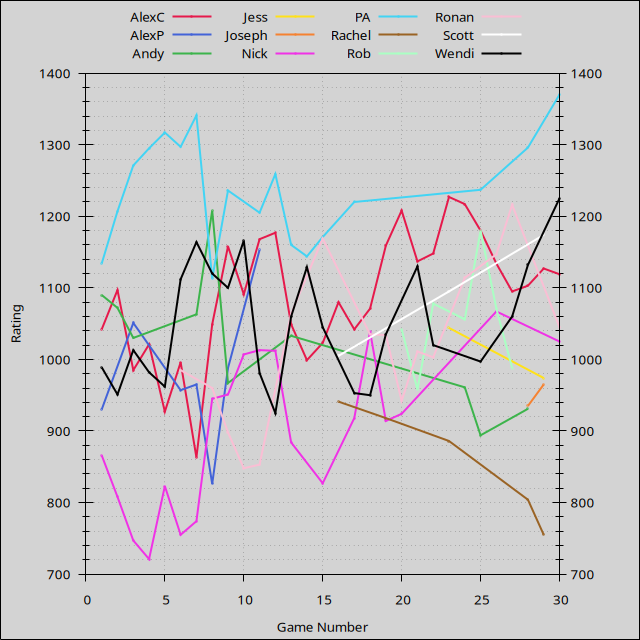
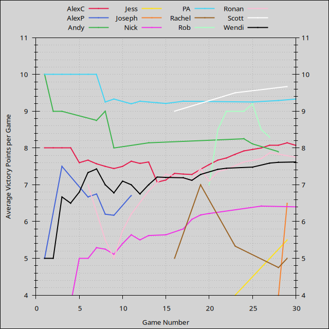
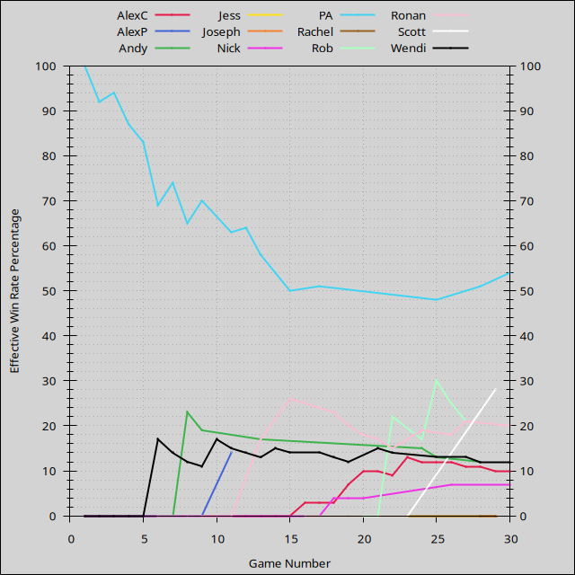
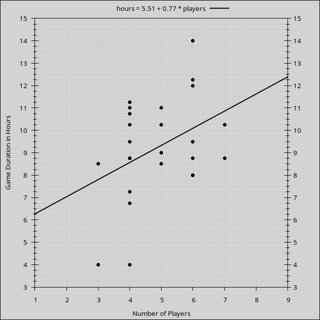

- [Players](#players)
    - [Players: Summary](#players-summary)
    - [Players: Ratings](#players-ratings)
    - [Players: Average Victory Points per Game](#players-average-victory-points-per-game)
    - [Players: Win Rates](#players-win-rates)
- [Factions](#factions)
    - [Factions: Summary](#factions-summary)
    - [Factions: Ratings](#factions-ratings)
    - [Factions: Average Victory Points per Game](#factions-average-victory-points-per-game)
    - [Factions: Win Rates](#factions-win-rates)
- [Time Duration](#time-duration)
- [Games](#games)
- [License](#license)

Last updated 2022-01-05 06:09 UTC.

# Players

- [Players: Summary](#players-summary)
- [Players: Ratings](#players-ratings)
- [Players: Average Victory Points per Game](#players-average-victory-points-per-game)
- [Players: Win Rates](#players-win-rates)

[(Back to Top)](#)

## Players: Summary

| **Player** | **Games** | **Current Rating** | **Avg Rating** | **Avg Points** | **1st Place** | **2nd Place** | **3rd Place** |
| :--- | :---: | :---: | :---: | :---: | :---: | :---: | :---: |
| AlexC | 25 | 1071 | 1013 | 7.96 | 16% (4) | 36% (9) | 32% (8) |
| AlexP | 7 | 999 | 980 | 6.71 | 14% (1) | 14% (1) | 14% (1) |
| Andy | 9 | 956 | 1006 | 8.11 | 11% (1) | 11% (1) | 33% (3) |
| Eftychi | 1 | 969 | 969 | 0.00 | 0% (0) | 0% (0) | 0% (0) |
| Jay | 1 | 994 | 994 | 4.00 | 0% (0) | 0% (0) | 0% (0) |
| Jess | 1 | 1006 | 1006 | 4.00 | 0% (0) | 0% (0) | 100% (1) |
| Nick | 18 | 914 | 915 | 6.22 | 6% (1) | 17% (3) | 17% (3) |
| PA | 16 | 1140 | 1114 | 9.25 | 56% (9) | 25% (4) | 6% (1) |
| Rachel | 3 | 939 | 953 | 5.33 | 0% (0) | 0% (0) | 33% (1) |
| Rob | 5 | 1034 | 1005 | 9.20 | 40% (2) | 20% (1) | 20% (1) |
| Ronan | 13 | 985 | 962 | 7.62 | 23% (3) | 8% (1) | 15% (2) |
| Scott | 2 | 1019 | 1009 | 9.50 | 0% (0) | 100% (2) | 0% (0) |
| Wendi | 21 | 976 | 999 | 7.48 | 19% (4) | 14% (3) | 19% (4) |

[(Back to Players)](#players)

## Players: Ratings

[(Back to Players)](#players)

## Players: Average Victory Points per Game

Victory points are adjusted relative to a 10-point game.

[(Back to Players)](#players)

## Players: Win Rates

[(Back to Players)](#players)

# Factions

- [Factions: Summary](#factions-summary)
- [Factions: Ratings](#factions-ratings)
- [Factions: Average Victory Points per Game](#factions-average-victory-points-per-game)
- [Factions: Win Rates](#factions-win-rates)

[(Back to Top)](#)

## Factions: Summary

Coming soon!

[(Back to Factions)](#factions)

## Factions: Ratings

Coming soon!

[(Back to Factions)](#factions)

## Factions: Average Victory Points per Game

Coming soon!

[(Back to Factions)](#factions)

## Factions: Win Rates

Coming soon!

[(Back to Factions)](#factions)

# Time Duration

[(Back to Top)](#)

# Games

| **Game** | **Date** | **Mode** | **Points** | **Players** | **Results** |
| :---: | :---: | :---: | :---: | :---: | :--- |
| 25 | 2021-12-27 | Free-for-All | 10 | 5 | 8h30m, 1st Rob 10 Argent Flight, 2nd PA 9 Ghosts of Creuss, 3rd AlexC 9 Winnu, 4th Wendi 8 Barony of Letnev, 5th Andy 7 Empyrean |
| 24 | 2021-12-18 | Free-for-All | 10 | 4 | 8h45m, 1st Ronan 10 Naalu Collective, 2nd AlexC 10 L1z1x Mindnet, 3rd Rob 9 Mahact Gene-Sorcerers, 4th Andy 9 Argent Flight |
| 23 | 2021-12-05 | Free-for-All | 5 | 6 | 8h45m, 1st AlexC 5 Vuil'raith Cabal, 2nd Scott 5 Mentak Coalition, 3rd Jess 2 Sardakk N'orr, 4th Jay 2 Argent Flight, 5th Rachel 1 Naaz-Rokha Alliance, 6th Eftychi 0 Mahact Gene-Sorcerers |
| 22 | 2021-11-20 | Free-for-All | 10 | 4 | 11h00m, 1st Rob 10 Titans of Ul, 2nd AlexC 9 Vuil'raith Cabal, 3rd Ronan 8 Barony of Letnev, 4th Wendi 8 Nekro Virus |
| 21 | 2021-10-16 | Free-for-All | 10 | 4 | 10h15m, 1st Wendi 10 Barony of Letnev, 2nd Ronan 10 Arborec, 3rd AlexC 10 Naaz-Rokha Alliance, 4th Rob 11 Vuil'raith Cabal |
| 20 | 2021-09-25 | Free-for-All | 10 | 4 | 8h45m, 1st AlexC 10 Winnu, 2nd Rob 7 Universities of Jol-Nar, 3rd Nick 7 Clan of Saar, 4th Ronan 4 Sardakk N'orr |
| 19 | 2021-09-05 | Free-for-All | 10 | 5 | 10h15m, 1st AlexC 10 Clan of Saar, 2nd Wendi 10 Universities of Jol-Nar, 3rd Ronan 10 Argent Flight, 4th Rachel 9 Empyrean, 5th Nick 8 Naaz-Rokha Alliance |
| 18 | 2021-07-31 | Free-for-All | 10 | 4 | 6h45m, 1st Nick 10 Argent Flight, 2nd AlexC 7 Xxcha Kingdom, 3rd Wendi 6 L1z1x Mindnet, 4th Ronan 6 Empyrean |
| 17 | 2021-07-10 | Free-for-All | 10 | 4 | 7h15m, 1st PA 10 Clan of Saar, 2nd Nick 8 Vuil'raith Cabal, 3rd AlexC 7 Federation of Sol, 4th Wendi 7 Universities of Jol-Nar |
| 16 | 2021-07-03 | Free-for-All | 10 | 3 | 8h30m, 1st AlexC 10 Federation of Sol, 2nd Scott 9 Nekro Virus, 3rd Rachel 5 Naaz-Rokha Alliance |
| 15 | 2021-06-26 | Free-for-All | 10 | 5 | 9h00m, 1st Ronan 10 Naaz-Rokha Alliance, 2nd PA 9 Arborec, 3rd AlexC 8 Clan of Saar, 4th Wendi 7 Naalu Collective, 5th Nick 6 L1z1x Mindnet |
| 14 | 2021-06-12 | Free-for-All | 10 | 3 | 4h00m, 1st Wendi 10 Clan of Saar, 2nd PA 9 Vuil'raith Cabal, 3rd AlexC 0 Winnu |
| 13 | 2021-05-29 | Free-for-All | 10 | 6 | 8h00m, 1st Ronan 11 Custom, 2nd Wendi 10 Custom, 3rd Andy 9 Custom, 4th PA 9 Custom, 5th AlexC 8 Custom, 6th Nick 7 Custom |
| 12 | 2021-05-15 | Free-for-All | 10 | 4 | 4h00m, 1st PA 10 Argent Flight, 2nd AlexC 7 L1z1x Mindnet, 3rd Nick 4 Vuil'raith Cabal, 4th Wendi 4 Arborec |
| 11 | 2021-05-01 | Free-for-All | 10 | 6 | 12h15m, 1st AlexP 10 Naalu Collective, 2nd AlexC 9 Titans of Ul, 3rd PA 8 Embers of Muaat, 4th Nick 8 Yin Brotherhood, 5th Ronan 8 Xxcha Kingdom, 6th Wendi 6 Nomad |
| 10 | 2021-04-17 | Free-for-All | 10 | 4 | 9h30m, 1st Wendi 10 Argent Flight, 2nd Nick 8 Xxcha Kingdom, 3rd AlexC 8 Federation of Sol, 4th Ronan 8 Vuil'raith Cabal |
| 9 | 2021-04-03 | Free-for-All | 10 | 7 | 10h15m, 1st PA 10 Custom, 2nd AlexC 7 Custom, 3rd AlexP 6 Custom, 4th Wendi 5 Custom, 5th Nick 4 Custom, 6th Ronan 4 Custom, 7th Andy 3 Custom |
| 8 | 2021-03-06 | Free-for-All | 10 | 7 | 8h45m, 1st Andy 10 Universities of Jol-Nar, 2nd AlexC 7 Argent Flight, 3rd Nick 5 Nomad, 4th Wendi 4 Empyrean, 5th Ronan 4 Barony of Letnev, 6th PA 4 Yin Brotherhood, 7th AlexP 4 Emirates of Hacan |
| 7 | 2021-02-20 | Free-for-All | 10 | 6 | 9h30m, 1st PA 10 Sardakk N'orr, 2nd Wendi 8 Mahact Gene-Sorcerers, 3rd Andy 8 Universities of Jol-Nar, 4th AlexP 7 Vuil'raith Cabal, 5th Nick 7 Titans of Ul, 6th AlexC 7 Embers of Muaat |
| 6 | 2021-02-06 | Free-for-All | 10 | 6 | 12h00m, 1st Wendi 10 Emirates of Hacan, 2nd PA 10 Mahact Gene-Sorcerers, 3rd AlexC 8 Federation of Sol, 4th Ronan 7 Universities of Jol-Nar, 5th AlexP 5 Argent Flight, 6th Nick 5 Nekro Virus |
| 5 | 2021-01-02 | Free-for-All | 10 | 4 | 1st PA 10 Winnu, 2nd Nick 10 Yssaril Tribes, 3rd Wendi 8 Federation of Sol, 4th AlexC 6 Nomad |
| 4 | 2021-01-02 | Free-for-All | 10 | 4 | 1st PA 10 Naaz-Rokha Alliance, 2nd AlexC 8 Argent Flight, 3rd Wendi 6 Mentak Coalition, 4th Nick 6 Vuil'raith Cabal |
| 3 | 2020-12-28 | Free-for-All | 10 | 6 | 1st PA 10 Empyrean, 2nd AlexP 10 Naaz-Rokha Alliance, 3rd Wendi 10 Titans of Ul, 4th Andy 9 Vuil'raith Cabal, 5th AlexC 8 Barony of Letnev, 6th Nick 4 Mahact Gene-Sorcerers |
| 2 | 2020-12-20 | Free-for-All | 10 | 5 | 1st PA 10 Titans of Ul, 2nd AlexC 8 Emirates of Hacan, 3rd Andy 8 Federation of Sol, 4th Wendi 5 Naaz-Rokha Alliance, 5th Nick 4 Vuil'raith Cabal |
| 1 | 2020-11-28 | Free-for-All | 10 | 6 | 1st PA 10 L1z1x Mindnet, 2nd Andy 10 Clan of Saar, 3rd AlexC 8 Federation of Sol, 4th Wendi 5 Yssaril Tribes, 5th AlexP 5 Nekro Virus, 6th Nick 1 Universities of Jol-Nar |

[(Back to Top)](#)

# License

This work is maintained by Alexandre Coderre-Chabot (https://github.com/acodcha) and licensed under the MIT License. For more details, see the `LICENSE` file or https://mit-license.org/. This work is based on the Twilight Imperium 4th Edition board game by Fantasy Flight Games. The contents, copyrights, and trademarks of everything involving Twilight Imperium 4th Edition are exclusively held by Fantasy Flight Games; I make no claim to any of these in any way.

[(Back to Top)](#)

